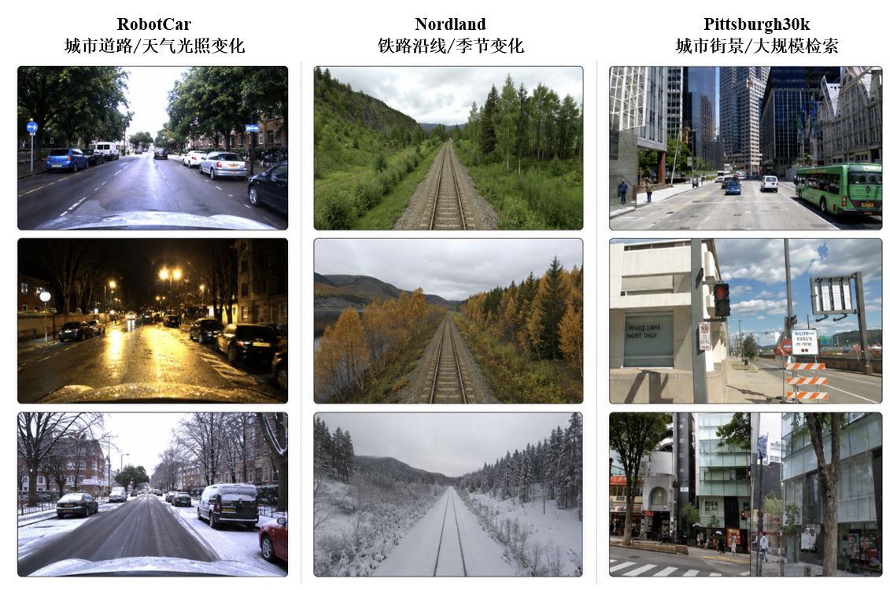
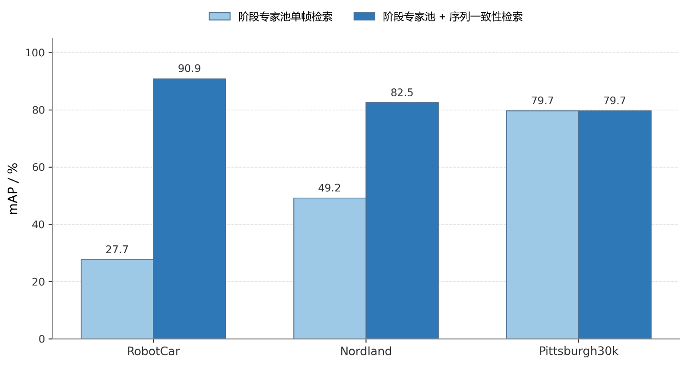
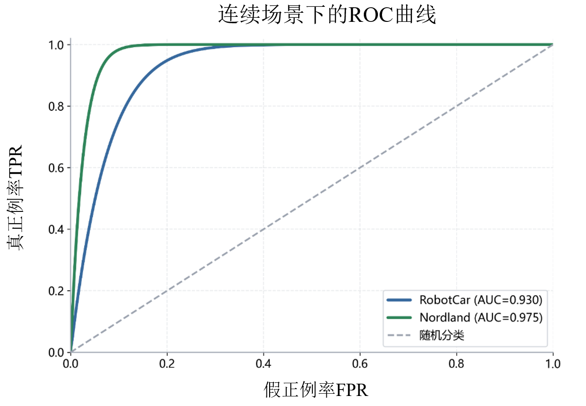

# Lifelong Visual Place Recognition with Long-Short-Term Knowledge Consolidation

A PyTorch implementation for lifelong visual place recognition (VPR) under multi-environment sequential learning. The project studies how a place recognition model adapts to new environments while preserving retrieval ability on previously learned environments.

The pipeline includes SNN-based visual feature extraction, descriptor projection, relation-based knowledge consolidation, stage expert memory, sequence-consistency reranking, and standard VPR evaluation with mAP and Recall@K.

<p align="center">
  
</p>

## Highlights

- **Multi-environment VPR learning** on Oxford RobotCar, Nordland, and Pittsburgh30k style query/gallery protocols.
- **SNN feature extraction** for image-level place descriptors.
- **Short-term knowledge transfer** between adjacent learning stages.
- **Long-term knowledge retention** with historical relation constraints and stage knowledge.
- **Stage expert pool and sequence reranking** for robust final retrieval in continuous scenes.
- **VPR metrics** including mAP, R@1, and R@5.

## Project Structure

```text
.
|-- assets/                 # Figures used in documentation
|-- configs/                # Training configuration files
|-- docs/                   # Dataset, reproduction, and result notes
|-- scripts/                # Experiment launch scripts
|-- src/
|   |-- datasets/           # Multi-environment dataset construction
|   |-- feature_extraction/ # SNN feature extraction and preprocessing
|   |-- knowledge/          # Short-term and long-term knowledge losses
|   |-- models/             # Descriptor heads and model interfaces
|   |-- retrieval/          # Expert pool, reranking, and retrieval tools
|   |-- evaluation/         # mAP / Recall@K evaluation
|   |-- trainers/           # Continual training pipeline
|   `-- utils/              # Logging, checkpoint, and data utilities
|-- tests/                  # Import and smoke tests
|-- requirements.txt
`-- README.md
```

## Installation

Create a Python environment and install the required packages:

```bash
pip install -r requirements.txt
```

The code was developed with PyTorch. A CUDA-enabled environment is recommended for training.

## Data Preparation

The datasets are not included in this repository. Prepare the VPR datasets locally and organize them according to your own storage path.

The experiments use:

- Oxford RobotCar
- Nordland
- Pittsburgh30k

<p align="center">
  
</p>

Example layout:

```text
DATA/
|-- robotcar_place/
|-- nordland_place/
`-- pitts30k_place/
```

Update the dataset root in the scripts under `scripts/` before running experiments.

## Quick Check

Run the import test to verify the project structure:

```bash
python -m tests.import_check
```

Expected output should report successful imports for dataset construction, model building, training, and retrieval modules.

## Training

The main continual learning entry is:

```text
src/trainers/continual_train.py
```

Example:

```bash
python -m src.trainers.continual_train --config_file configs/base.yml
```

For the thesis experiments, use or adapt the scripts in:

```text
scripts/
```

Before running, check the following paths in the selected script:

- dataset root
- pretrained weight path
- log directory
- cache directory
- output directory

## Evaluation

Retrieval and analysis tools are located in:

```text
src/retrieval/tools/
```

Common evaluation components include:

- single-stage query/gallery retrieval
- continual learning stage evaluation
- stage expert pool evaluation
- sequence-consistency reranking
- mAP and Recall@K reporting

## Example Results

The following figures show representative retrieval performance from the thesis experiments.

<p align="center">
  
</p>

<p align="center">
  
</p>

## Notes

Large experiment files are intentionally excluded from this repository, including:

- full datasets
- pretrained weights
- training checkpoints
- feature caches
- large logs

Please place these files locally and update the corresponding paths in your scripts.

## Acknowledgement

This project is developed for a thesis on lifelong visual place recognition. It builds a clean research codebase around multi-environment VPR, SNN feature extraction, knowledge consolidation, and retrieval enhancement.
